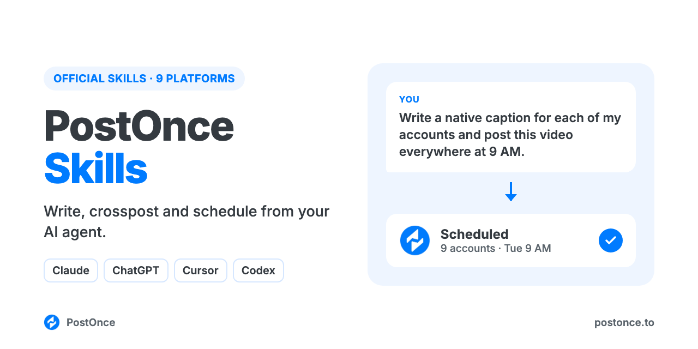

<p align="center"></p>

# PostOnce Skills

The official [PostOnce](https://postonce.to) social media skills and MCP server for Claude, ChatGPT, Cursor and Codex. Your AI agent writes a native post for each platform, crossposts it to LinkedIn, X, Threads, Bluesky, Facebook, Instagram, TikTok, YouTube and Pinterest in one request, and plans and schedules weeks of content, all through each platform's official API. There's no scraping, no browser automation and no developer apps to set up.

The skills know each platform's limits and formats, and come with 100 proven hooks and 49 viral video formats, so your agent writes posts that fit before it publishes them.

```
You:    Turn this blog post into posts for all my accounts and schedule them
        for tomorrow at 9am.
Claude: Used the post-everywhere skill. One idea, a native version per
        account: a LinkedIn post that ends on a question, a 240-character X
        post, a Threads post, a Bluesky post, a Facebook Page post and a pin
        made from the article's image. Scheduled for Tue 9:00 AM on 6 accounts.
        Instagram, TikTok and YouTube need an image or video, so they're
        saved as drafts until you add one.
```

## What you can do

| Ask your agent to | How it works |
| --- | --- |
| Post the same idea everywhere, written for each platform | One `create_post` with a `content_override` per account |
| Schedule posts for later, or build a whole calendar | `create_post` with `publish_at`; drafts with `create_draft` |
| Publish images, carousels and video | `create_upload_url`, upload, then pass the media URLs |
| Crosspost every future post automatically | `create_workflow`: for example, each new Instagram Reel also goes to TikTok, Shorts and Facebook |
| Check what went out, per platform | `get_post` returns each destination's status and URL |
| Change or cancel a scheduled post | `update_post`, `cancel_post` |

Platforms: LinkedIn (profiles and company pages), X, Threads, Bluesky, Facebook Pages, Instagram (Business or Creator), TikTok, YouTube and Pinterest. Not supported: Stories, reply chains and polls, first comments, analytics, reading comments, and editing posts that are already live.

## Skills included

| Skill | What it does |
| --- | --- |
| [`post-everywhere`](skills/post-everywhere/SKILL.md) | Turns one idea, draft, link or video into a native post for every connected platform, checked against each platform's limits and media rules, and sends them in one request. |
| [`content-calendar`](skills/content-calendar/SKILL.md) | Plans 1 to 4 weeks of posts across your platforms from your goals or a source to repurpose, then schedules them. |
| [`hook-vault`](skills/hook-vault/SKILL.md) | Writes opening lines from 100 hook templates taken from real viral posts on TikTok, Reels, Shorts, LinkedIn and X. |
| [`viral-formats`](skills/viral-formats/SKILL.md) | Picks and scripts a video format from 49 formats ranked by how consistently they go viral, each with a real example. |
| [`postonce`](skills/postonce/SKILL.md) | The publishing workflow: pick accounts, upload media, schedule, set up automatic crossposting, confirm delivery and recover without duplicate posts. |

## Setup (about a minute)

You need a [PostOnce account](https://postonce.to) (free for 7 days, no card) with your social accounts connected.

**Claude (claude.ai and desktop) and ChatGPT:** add a custom connector with the URL below and sign in with PostOnce. No API key.

```
https://postonce.to/mcp
```

Step-by-step: [Claude](https://postonce.to/integrations/claude) · [ChatGPT](https://postonce.to/integrations/chatgpt)

**Claude Code, Codex and Cursor:** install the plugin. It adds the MCP connection and the skills together. Claude Code asks you to sign in to PostOnce the first time you use it (or run `/mcp` and pick postonce), so there's no key to copy. In Codex and Cursor, create an API key in [PostOnce preferences](https://postonce.to/dashboard/preferences) and give it to your client as the `POSTONCE_API_KEY` environment variable. Never paste the key into chat.

```bash
# Claude Code
claude plugin marketplace add postoncehq/plugins
claude plugin install postonce@postoncehq
```

Step-by-step: [Claude Code](https://postonce.to/integrations/claude-code) · [Codex](https://postonce.to/integrations/codex) · [Cursor](https://postonce.to/integrations/cursor)

**Any other MCP client:** point it at `https://postonce.to/mcp` (Streamable HTTP) with the header `Authorization: Bearer <your PostOnce API key>`.

## Data and privacy

- The posts, captions and media you ask your agent to publish are sent to PostOnce and on to the platforms you choose. Nothing is published without a request from you.
- Media files you upload go straight to PostOnce's file storage through a short-lived signed upload link, then publish from there. Uploaded media is publicly reachable so the platforms can fetch it.
- PostOnce stores your posts, media and connected account names so it can schedule them and show your publishing history. You can disconnect accounts and revoke access at any time in [PostOnce preferences](https://postonce.to/dashboard/preferences).
- The skills themselves run in your agent and send nothing anywhere else. The hook vault and viral formats data ship inside the plugin.

Full details: [privacy policy](https://postonce.to/privacy-policy) · [terms](https://postonce.to/tos).

## FAQ

**What is crossposting?**
Publishing the same content to several social platforms. Done well, each platform gets a version written for it: different length, first line, hashtags and format. The `post-everywhere` skill does that for every account in one request.

**Can Claude or ChatGPT post to all my social media at once?**
Yes, once they're connected to an MCP server that can publish, like this one. Your agent writes each version and PostOnce publishes them together.

**Can it crosspost automatically, without asking my agent each time?**
Yes. A PostOnce workflow watches a source account and sends each new post to the destinations you choose. Ask your agent to set one up.

**Is it safe for my accounts?**
Yes. Every post goes through each platform's official API with the permissions you grant when you connect. Tools that drive a logged-in browser or an unofficial API break most platforms' terms and can get accounts restricted.

**Do I need developer apps or API approvals?**
No. PostOnce holds the platform API access; you connect your accounts once.

**Is it free?**
The skills are free and MIT-licensed. Publishing runs through a PostOnce account, which you can try free for 7 days without entering a card. After that, see [pricing](https://postonce.to/pricing).

## Platform plugins

For deeper writing skills on one network (carousels, scripts, threads, thumbnails), add the platform plugins from the same marketplace:
[LinkedIn MCP](https://github.com/postoncehq/linkedin-mcp) · [Instagram MCP](https://github.com/postoncehq/instagram-mcp) · [TikTok MCP](https://github.com/postoncehq/tiktok-mcp) · [YouTube MCP](https://github.com/postoncehq/youtube-mcp) · [Facebook MCP](https://github.com/postoncehq/facebook-mcp) · [X (Twitter) MCP](https://github.com/postoncehq/x-mcp) · [Threads MCP](https://github.com/postoncehq/threads-mcp) · [Bluesky MCP](https://github.com/postoncehq/bluesky-mcp) · [Pinterest MCP](https://github.com/postoncehq/pinterest-mcp)

## License

MIT. See [LICENSE](LICENSE).
